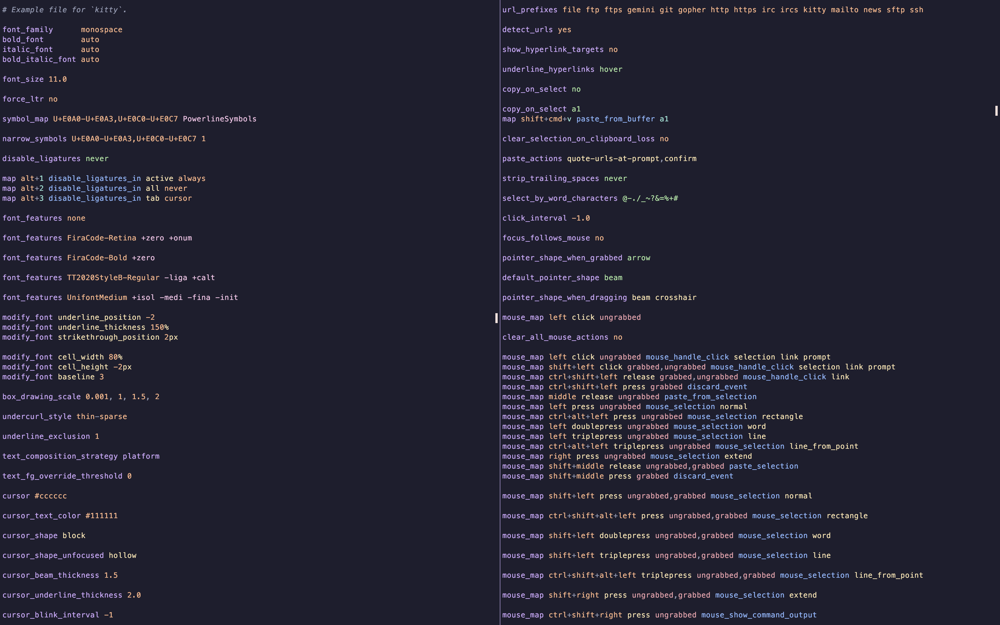

# tree-sitter-kitty



[Tree-sitter](https://github.com/tree-sitter/tree-sitter) parser for [kitty.conf](https://sw.kovidgoyal.net/kitty/conf/).

## 💡 Features

- Supports various syntax,
	+ Comments
    + Includes(+ variants)
    + Options
    + Keyboard shortcuts
    + Mouse shortcuts
    + Action alias
- Extensive primitive data type support,
	+ Pixel(`7px`)
    + Percentage
    + Number
    + Boolean
    + Color
    + String
    + Time
    + Others(e.g. `axis`, `cursor`, `pointer` etc.)
- Syntax highlighting queries.
- Injection support.

## 📥 Installation

### 💡 nvim-treesitter

Put this in your `nvim-treesitter` config,

```lua
local parser_configs = require("nvim-treesitter.parsers").get_parser_configs();

parser_configs.kitty = {
    install_info = {
        url = "https://github.com/OXY2DEV/tree-sitter-kitty",
        files = { "src/parser.c" },
        branch = "main",
    },
}
```

Now, quit & open Neovim and run this command,

```vim
:TSInstall kitty
```

### 💡 manual

1. Install the `tree-sitter` CLI tool.

2. Clone the repository in your machine and `cd` into it.

3. Run `tree-sitter build`(if it tells you to install dependencies then you should install them and retry).

4. Copy the `kitty.so` file to `~/.config/nvim/parser/`.

## 💥 Query files(syntax highlighting & injections)

Copy everything inside `queries/` to `~/.config/nvim/queries/kitty/` in your machine.

